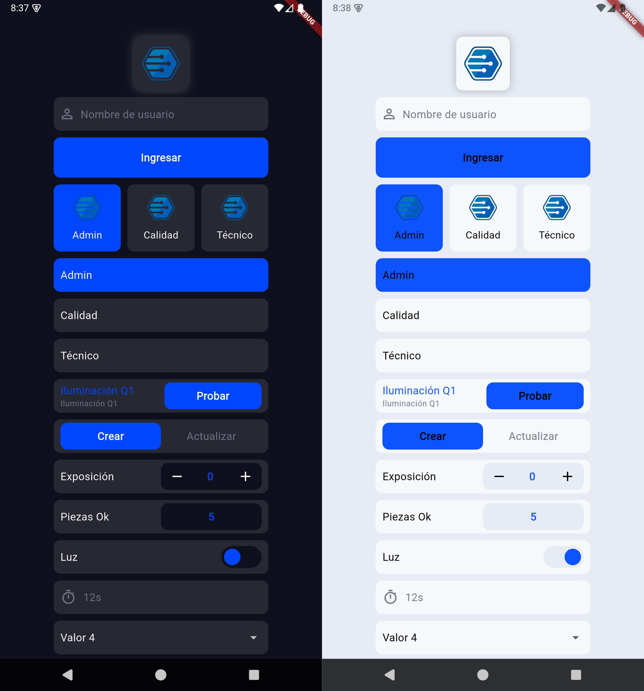

# issel_code_widgets

Paquete Flutter con widgets reutilizables de IsselCode para construir interfaces con estilos consistentes, componentes de formulario, selectores, tarjetas, tablas y estados de carga.

<p align="center">
  
</p>

`issel_code_widgets` está pensado como un kit práctico para freelancers, estudiantes y desarrolladores que quieren crear aplicaciones Flutter simples, bonitas y funcionales sin diseñar cada componente desde cero.

La idea del paquete es reducir el tiempo dedicado a construir botones, campos, tarjetas, selectores y layouts comunes cuando el proyecto no necesita un sistema de diseño complejo, pero sí una interfaz clara, ordenada y fácil de entender.

## Objetivo del Paquete

Este paquete busca ayudarte a avanzar más rápido en proyectos reales donde el cliente necesita una app funcional con una interfaz limpia, sin requerir un diseño completamente personalizado para cada pantalla.

Es especialmente útil para:

- Freelancers que entregan proyectos administrativos, MVPs o herramientas internas.
- Desarrolladores que están iniciando y quieren apoyarse en widgets ya diseñados.
- Proyectos con presupuesto o tiempo limitado.
- Aplicaciones donde la prioridad es la funcionalidad, claridad y rapidez de desarrollo.
- Interfaces que necesitan verse bien sin invertir horas diseñando cada widget manualmente.

El paquete toma decisiones visuales por defecto para que los componentes funcionen bien apenas los agregas a tu app. Aun así, varios widgets permiten personalizar tamaños, colores, textos, callbacks y contenido cuando necesitas ajustar el resultado.

## Características

- Botones, pills, toggles y selectores personalizados.
- Campos de formulario con validación, dropdowns y búsqueda.
- Componentes informativos para mostrar valores, iconos y acciones de copiado.
- Tarjetas de acción y opciones seleccionables.
- Carrusel horizontal con selección animada.
- Tabla compuesta por encabezado y filas reutilizables.
- Indicadores visuales como shimmer y progreso circular.

## Instalación

> Este paquete aún no está publicado en pub.dev.
> Por ahora debe agregarse usando una ruta local o un repositorio Git.

Agrega el paquete a tu `pubspec.yaml`:

```yaml
dependencies:
  issel_code_widgets:
    path: ruta/al/paquete
```

También puedes agregarlo desde un repositorio Git:

```yaml
dependencies:
  issel_code_widgets:
    git:
      url: https://github.com/usuario/issel_code_widgets.git
```

Después ejecuta:

```bash
flutter pub get
```

## Importación

```dart
import 'package:issel_code_widgets/issel_code_widgets.dart';
```

## Uso Básico

### Botón

```dart
IsselButton(
  text: 'Guardar',
  onTap: () {
    // Acción del botón
  },
)
```

### Campo de Texto

```dart
final controller = TextEditingController();

IsselTextFormField(
  controller: controller,
  hintText: 'Nombre',
  prefixIcon: Icons.person_outline,
  validator: (value) {
    if (value == null || value.isEmpty) {
      return 'Campo requerido';
    }
    return null;
  },
)
```

### Dropdown

```dart
String? selectedValue;

IsselDropdown<String>(
  value: selectedValue,
  hintText: 'Selecciona una opción',
  items: const [
    DropdownMenuItem(value: 'uno', child: Text('Uno')),
    DropdownMenuItem(value: 'dos', child: Text('Dos')),
  ],
  onChanged: (value) {
    selectedValue = value;
  },
)
```

### Dropdown con Búsqueda

```dart
IsselSearchDropdown<String>(
  value: selectedValue,
  hintText: 'Buscar opción',
  maxItemsToShow: 5,
  items: const [
    DropdownMenuItem(value: 'mx', child: Text('México')),
    DropdownMenuItem(value: 'co', child: Text('Colombia')),
  ],
  onSearchChanged: (text) {
    // Filtra o consulta datos
  },
  onChanged: (value) {
    selectedValue = value;
  },
)
```

### Tarjeta de Acción

```dart
IsselActionBox(
  asset: 'assets/icons/home.png',
  title: 'Inicio',
  height: 120,
  width: 120,
  onTap: () {
    // Abrir sección
  },
  onDeleteTap: () {
    // Eliminar elemento
  },
)
```

### Toggle

```dart
bool enabled = true;

IsselToggleField(
  title: 'Activo',
  value: enabled,
  onChanged: (value) {
    enabled = value;
  },
)
```

### Stepper Numérico

```dart
IsselStepperField(
  title: 'Cantidad',
  minValue: 0,
  maxValue: 10,
  initValue: 1,
  onChanged: (value) {
    // Nuevo valor
  },
)
```

### Tabla

```dart
IsselTableWidget(
  header: const IsselHeaderTable(
    titleHeaders: ['Nombre', 'Estado'],
  ),
  rows: [
    IsselRowTable(
      cells: [
        IsselPill(text: 'Proyecto A'),
        IsselPill(text: 'Activo'),
      ],
    ),
  ],
  onTapRow: (index) {
    // Fila presionada
  },
)
```

## Widgets Disponibles

### Acciones y Contenedores

- `IsselActionBox`: caja presionable con imagen, título y acción opcional de eliminar.
- `IsselAssetContainer`: contenedor para mostrar un asset local o un favicon por dominio.
- `IsselButton`: botón principal estilizado.
- `IsselPill`: contenedor tipo píldora para texto o contenido personalizado.
- `IsselHeaderActionTile`: encabezado con título, subtítulo y botón de acción.

### Formularios

- `IsselTextFormField`: campo de texto compatible con `Form`.
- `IsselFloatTextField`: campo que abre un editor flotante.
- `IsselDropdown`: dropdown simple estilizado.
- `IsselDropdown2`: dropdown compatible con validación de `Form`.
- `IsselSearchDropdown`: dropdown con campo de búsqueda integrado.
- `IsselStepperField`: campo numérico con botones para incrementar y decrementar.

### Selección

- `IsselRadioCard`: opción seleccionable tipo tarjeta con imagen.
- `IsselRadioTile`: opción seleccionable horizontal con texto.
- `IsselToggle`: interruptor booleano personalizado.
- `IsselToggleField`: campo con etiqueta e interruptor.
- `IsselTabSwitcher`: selector de dos estados con indicador animado.
- `TabSwitcherAlignStates`: enum con los estados `left` y `right`.

### Información y Estado

- `IsselInfoField`: campo informativo con título y valor destacado.
- `IsselInfoField2`: campo informativo con icono, texto y copiado opcional.
- `IsselShimmer`: placeholder con efecto shimmer.
- `IsselCircularProgressIndicator`: indicador circular animado.

### Carrusel y Tablas

- `IsselCarousel`: carrusel horizontal con selección animada.
- `IsselHeaderTable`: encabezado de tabla.
- `IsselRowTable`: fila de tabla.
- `IsselTableWidget`: tabla con encabezado y filas desplazables.

## Consideraciones

- Los widgets usan `Theme.of(context)` y `ColorScheme` para integrarse con el tema de la aplicación.
- Los widgets que usan imágenes locales requieren que los assets estén declarados en el `pubspec.yaml` de la app.
- `IsselAssetContainer` puede cargar favicons desde red usando el dominio proporcionado en `network`.
- `IsselDropdown2` e `IsselTextFormField` pueden usarse dentro de un `Form` con validadores.

## Desarrollo

Para formatear el paquete:

```bash
dart format lib
```

Para analizar el proyecto:

```bash
dart analyze
```
