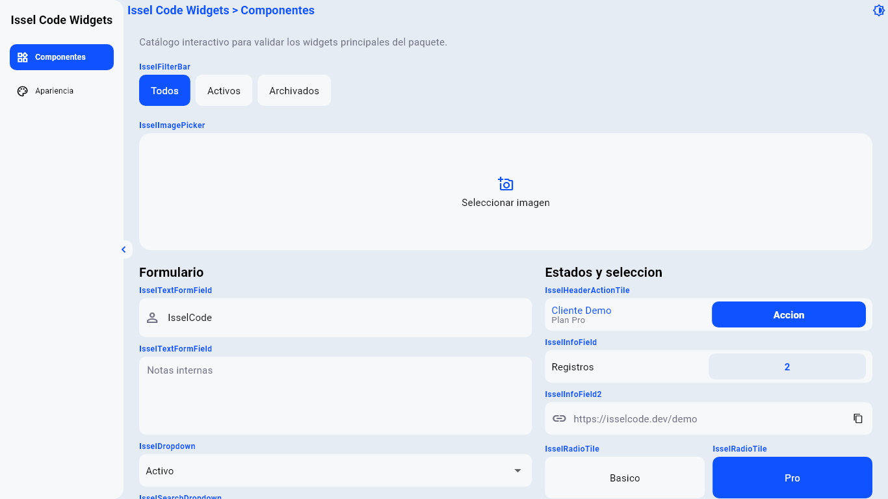
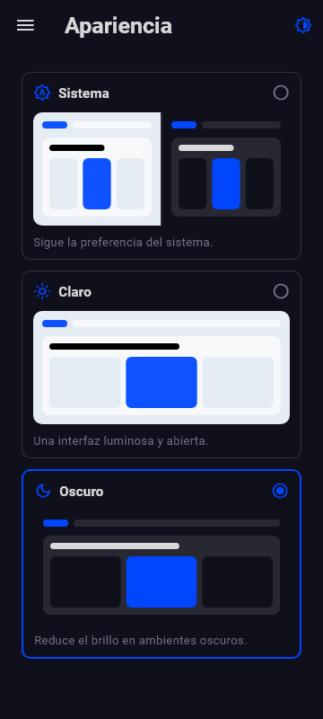

# issel_code_widgets

Paquete Flutter con widgets reutilizables de IsselCode para construir interfaces con estilos consistentes, componentes de formulario, selectores, tarjetas, tablas y estados de carga.

<p align="center">
  
</p>

`issel_code_widgets` está pensado como un kit práctico para freelancers, estudiantes y desarrolladores que quieren crear aplicaciones Flutter simples, bonitas y funcionales sin diseñar cada componente desde cero.

La idea del paquete es reducir el tiempo dedicado a construir botones, campos, tarjetas, selectores y layouts comunes cuando el proyecto no necesita un sistema de diseño complejo, pero sí una interfaz clara, ordenada y fácil de entender.

## Objetivo del Paquete

Este paquete busca ayudarte a avanzar más rápido en proyectos reales donde el cliente necesita una app funcional con una interfaz limpia, sin requerir un diseño completamente personalizado para cada pantalla.

Es especialmente útil para:

- Freelancers que entregan proyectos administrativos, MVPs o herramientas internas.
- Desarrolladores que están iniciando y quieren apoyarse en widgets ya diseñados.
- Proyectos con presupuesto o tiempo limitado.
- Aplicaciones donde la prioridad es la funcionalidad, claridad y rapidez de desarrollo.
- Interfaces que necesitan verse bien sin invertir horas diseñando cada widget manualmente.

El paquete toma decisiones visuales por defecto para que los componentes funcionen bien apenas los agregas a tu app. Aun así, varios widgets permiten personalizar tamaños, colores, textos, callbacks y contenido cuando necesitas ajustar el resultado.

## Características

- Botones, pills, toggles y selectores personalizados.
- Campos de formulario con validación, dropdowns y búsqueda.
- Componentes informativos para mostrar valores, iconos y acciones de copiado.
- Tarjetas de acción y opciones seleccionables.
- Carrusel horizontal con selección animada y barra de filtros.
- Tabla compuesta por encabezado y filas reutilizables.
- Indicadores visuales como shimmer y progreso circular.
- Servicio de navegación inyectable y tipos Dart para errores y resultados.
- Configuración central del kit y componentes de escritorio con menú lateral.

## Instalación

> Este paquete aún no está publicado en pub.dev.
> Por ahora debe agregarse usando una ruta local o un repositorio Git.

Agrega el paquete a tu `pubspec.yaml`:

```yaml
dependencies:
  issel_code_widgets:
    path: ruta/al/paquete
```

También puedes agregarlo desde un repositorio Git:

```yaml
dependencies:
  issel_code_widgets:
    git:
      url: https://github.com/IsselCode/issel_code_widgets.git
```

Después ejecuta:

```bash
flutter pub get
```

## Importación

```dart
import 'package:issel_code_widgets/issel_code_widgets.dart';
```

## Configuración de la aplicación

Para proyectos nuevos con la skill Issel, concentra los valores personalizables
en una feature de la app: `lib/src/issel/presentation/controllers/app_issel_controller.dart`.
El paquete aporta `IsselAppController` y los defaults; la skill crea esa integración.

```dart
class AppIsselController extends IsselAppController {
  AppIsselController()
      : super(config: const IsselAppConfig(
          title: 'Mi aplicación',
          lightTheme: IsselThemeConfig(
            colors: IsselThemeColors.light(primary: Color(0xff7B1FA2)),
          ),
          darkTheme: IsselThemeConfig(colors: IsselThemeColors.dark()),
          desktop: IsselDesktopConfig(sidebarWidth: 190, captionHeight: 32),
        ));
}
```

Crea una sola instancia en la raíz o en la composición de dependencias. Observa
el controlador para reconstruir `MaterialApp` con `theme: issel.theme.lightTheme`,
`darkTheme: issel.theme.darkTheme`, `themeMode: issel.theme.themeMode` y
`navigatorKey: issel.navigation.navigatorKey`. `issel.theme` es un
`IsselThemeController` estable y propiedad del controlador de app; `dispose`
lo libera. No lo liberes además desde otro Provider.

`updateConfig` conserva la identidad del tema y la clave de navegación. Los
cambios de tema también actualizan `issel.config`. La persistencia de preferencias
se integra desde la app. `issel_app.dart` permite importar sólo esta composición.
El [ejemplo](example/lib/main.dart) incluye la feature y navegación adaptable.

La configuración de apariencia también se adapta a móvil:

<p align="center">
  
</p>

## Tema predeterminado y configuración

Los widgets leen `Theme.of(context).colorScheme` y `Theme.of(context).textTheme`,
por lo que tambien pueden usarse con el tema propio de cada aplicacion. Cuando
el proyecto no tiene un sistema visual definido, el paquete ofrece un tema
Issel configurable con los valores probados para sus componentes:

```dart
final themeController = IsselThemeController(
  lightColors: const IsselThemeColors.light(
    primary: Color(0xff7B1FA2),
    secondary: Color(0xff4A148C),
  ),
  text: const IsselTextThemeConfig(
    bodyMediumHeight: 1.15,
    labelMediumHeight: 1.1,
  ),
);

AnimatedBuilder(
  animation: themeController,
  builder: (_, __) => MaterialApp(
    theme: themeController.lightTheme,
    darkTheme: themeController.darkTheme,
    themeMode: themeController.themeMode,
    home: const HomePage(),
  ),
);
```

`IsselThemeColors.light()` y `IsselThemeColors.dark()` contienen los colores
base, incluyendo `scaffoldBackground`, `surface`, `surfaceContainer`,
`primary` y `outline`. Las alturas tipograficas empiezan en `1.0`; solo se
incrementan cuando el proyecto las configura mediante `IsselTextThemeConfig`.
Las apps nuevas con la skill usan este controlador mediante `IsselAppController`.
Los widgets mantienen compatibilidad con un `ThemeData` propio que exponga
los roles semánticos del tema. `IsselTextThemeConfig.fontFamily` permite usar
una fuente proporcionada o registrada por la aplicación.

## Escritorio

Los componentes de `issel_desktop.dart` también se exportan desde el barrel
principal. Su composición sigue el patrón de PPG Trazabilidad:

```dart
IsselDesktopScaffold(
  config: issel.config.desktop,
  sidebarOpen: sidebarOpen,
  onSidebarClose: closeSidebar,
  caption: IsselDesktopCaption(
    title: IsselBreadcrumbs(items: breadcrumbs),
    leading: menuButton,
    actions: captionActions,
  ),
  sidebar: IsselNavigationPane(
    items: destinations,
    selectedId: currentSectionId,
    onSelected: openSection,
  ),
  child: currentView,
);
```

La app proporciona los destinos y callbacks. El menú usa selección controlada,
lista desplazable y header/footer opcionales. Las acciones de caption usan
`IsselCaptionButton` con tooltip y comportamiento de foco, teclado y hover.
El scaffold reserva la altura de la barra; no sumes esa altura al padding de
cada vista. `edgeToEdge` superpone la barra cuando un flujo lo necesita. En
ventanas estrechas el menú se superpone al contenido.

Integra los plugins de ventana desde un adaptador de plataforma en la app:
`dragAreaBuilder` envuelve el área de título y `windowControls` recibe minimizar,
maximizar/restaurar y cerrar. Esto permite usar window_manager y Snap Layouts
en Windows conservando la compilación para otras plataformas. La composición
del ejemplo no invoca controles nativos; el adaptador debe conectar acciones
reales y observar cambios de estado de ventana.

## Controladores y operaciones asíncronas

`IsselController` es una base de presentación que expone `isDisposed` y
`notifyIfActive()`. Comprueba su ciclo de vida después de esperar operaciones,
incluidos `catch` y `finally`, antes de modificar estado o notificar. La base
no cancela operaciones de red. Al liberar streams/timers llama también a
`super.dispose()`.

Las acciones devuelven `AppResult<T>` y actualizan el estado observable; la
vista espera el resultado y, después de comprobar `mounted`, decide toast,
navegación o cierre de diálogo. Deshabilita guardar durante `isSaving` y evita
enviar dos operaciones simultáneas. Un resultado que llega tras cerrar la vista
puede completarse sin notificar un controlador liberado.

## Navegación reutilizable

`IsselNavigationService` se exporta desde `issel_code_widgets.dart` y también
desde `issel_navigation.dart`. Crea una instancia en la composición de la app
y conecta su clave al `MaterialApp`; conserva esa instancia al reconstruirlo:

```dart
final navigation = IsselNavigationService();

MaterialApp(
  navigatorKey: navigation.navigatorKey,
  home: const HomePage(),
);

// Desde una acción de presentación, una vez montado el Navigator:
final saved = await navigation.navigateTo<bool>(
  const EditPage(),
  settings: const RouteSettings(name: '/edit', arguments: {'id': 42}),
);

// Desde EditPage, después de guardar:
await navigation.goBack(true);
```

Inyecta la instancia mediante el mecanismo de la app, por ejemplo constructor,
Provider o GetIt. El paquete no agrega dependencias de inyección ni registra
un singleton global. `isReady` indica si la clave está conectada; una acción
de navegación antes de montar el Navigator produce un `StateError` explícito.

| Operación | Comportamiento |
| --- | --- |
| `navigateTo<T>(page)` | Abre una página y devuelve su resultado tipado al cerrar. |
| `pushReplacement<T, TO>(page, result: ...)` | Reemplaza la ruta actual y completa su resultado anterior. |
| `pushAndRemoveUntil<T>(page, predicate: ...)` | Limpia la pila por defecto; un predicado permite conservar rutas previas. |
| `popUntilWidget(type)` / `popUntilRoute(name)` | Vuelve a un destino; si no existe, conserva la primera ruta. |
| `goBack<T>(result)` | Solicita volver respetando `PopScope`, sin retirar la ruta raíz. |
| `pushRoute<T>(route)` | Usa una ruta o transición definida por la app. |

`RouteSettings` y `fullscreenDialog` son configurables al abrir o reemplazar
páginas. Sin un nombre explícito se utiliza el tipo de widget. `canGoBack`
describe la pila; no evalúa bloqueos de `PopScope`. El resultado de `goBack`
indica si la petición fue atendida: puede ser `true` aunque `PopScope` impida
salir. Para Navigators anidados, conecta otra instancia a la clave de esa pila.

Este helper cubre navegación imperativa mediante `Navigator`. Si la app necesita
URLs, deep links o restauración declarativa de rutas, utiliza su router y
conserva la navegación fuera del dominio. Consulta la
[guía de navegación de Flutter](https://docs.flutter.dev/ui/navigation).

## Errores y resultados para datos y dominio

Importa esta biblioteca dedicada para usar tipos compartidos sin importar
Flutter ni los widgets:

```dart
import 'package:issel_code_widgets/issel_core.dart';

abstract interface class CustomerRepository {
  Future<AppResult<String>> loadName(int id);
}

// Ejemplo de repositorio con una integración inyectada por la app:
class CustomerRepositoryImpl implements CustomerRepository {
  CustomerRepositoryImpl({required this.fetchName});

  final Future<String> Function(int id) fetchName;

  @override
  Future<AppResult<String>> loadName(int id) async {
    try {
      return AppResult.success(await fetchName(id));
    } on AppException catch (exception) {
      return AppResult.error(AppFailure.fromException(exception));
    }
  }
}

Future<String> example() async {
  final repository = CustomerRepositoryImpl(
    fetchName: (_) async => throw const AppException(
      message: 'No fue posible cargar el cliente',
      code: 'connection',
    ),
  );
  final result = await repository.loadName(42);
  return result.fold(
    onSuccess: (name) => name,
    onError: (failure) => failure.message,
  );
}
```

`AppException` y `AppFailure` admiten `message`, `code`, `cause` y `stackTrace`.
El mensaje es para presentación; la causa y la traza permiten conservar el
diagnóstico. `AppResult<T>` contiene `AppSuccess<T>` con un valor, o
`AppError<T>` con un fallo; admite `fold` y `switch` exhaustivo, sin `dartz`.
Los códigos y políticas de recuperación pertenecen a cada app. Convierte los
errores esperados en el límite apropiado; deja propagarse errores de programación.

Estos tipos se exportan sólo desde `issel_core.dart` para mantener aislado el
dominio y evitar ambigüedades con un `AppException` existente cuando se importan
los widgets. Si migras helpers propios, reemplaza sus imports de forma explícita.
El paquete sigue siendo Flutter, pero esta biblioteca utiliza únicamente Dart.

## Uso Básico

### Botón

```dart
IsselButton(
  text: 'Guardar',
  onTap: () {
    // Acción del botón
  },
)
```

### Campo de Texto

```dart
final controller = TextEditingController();

IsselTextFormField(
  controller: controller,
  hintText: 'Nombre',
  prefixIcon: Icons.person_outline,
  validator: (value) {
    if (value == null || value.isEmpty) {
      return 'Campo requerido';
    }
    return null;
  },
)
```

### Dropdown

```dart
String? selectedValue;

IsselDropdown<String>(
  value: selectedValue,
  hintText: 'Selecciona una opción',
  items: const [
    DropdownMenuItem(value: 'uno', child: Text('Uno')),
    DropdownMenuItem(value: 'dos', child: Text('Dos')),
  ],
  onChanged: (value) {
    selectedValue = value;
  },
)
```

### Dropdown con Búsqueda

```dart
IsselSearchDropdown<String>(
  value: selectedValue,
  hintText: 'Buscar opción',
  overlay: true,
  maxItemsToShow: 5,
  items: const [
    DropdownMenuItem(value: 'mx', child: Text('México')),
    DropdownMenuItem(value: 'co', child: Text('Colombia')),
  ],
  onSearchChanged: (text) {
    // Filtra o consulta datos
  },
  onChanged: (value) {
    selectedValue = value;
  },
)
```

### Tarjeta de Acción

```dart
IsselActionBox(
  asset: 'assets/icons/home.png',
  title: 'Inicio',
  height: 120,
  width: 120,
  onTap: () {
    // Abrir sección
  },
  onDeleteTap: () {
    // Eliminar elemento
  },
)
```

### Toggle

```dart
bool enabled = true;

IsselToggleField(
  title: 'Activo',
  value: enabled,
  onChanged: (value) {
    enabled = value;
  },
)
```

Para permitir varias líneas, configura `minLines`, `maxLines` y una altura
mayor:

```dart
IsselTextFormField(
  controller: descriptionController,
  hintText: 'Descripción',
  prefixIcon: Icons.description_outlined,
  minLines: 3,
  maxLines: 5,
  height: 120,
)
```

### Selector de imágenes

```dart
IsselImagePicker(
  bytes: selectedImageBytes,
  onChanged: (bytes) {
    selectedImageBytes = bytes;
  },
  height: 210,
  width: double.infinity,
  fit: BoxFit.contain,
  showClearButton: true,
  placeholderText: 'Seleccionar imagen',
)
```

El widget abre `FilePicker` automáticamente. Puedes usar `validator` dentro de
un `Form`, ajustar `width`, `height` y cualquier valor de `BoxFit`, y usar
`pickImage` si necesitas reemplazar el selector predeterminado. `showClearButton`
es `true` por defecto.

### Barra de filtros

```dart
IsselFilterBar<String>(
  value: selectedValue,
  options: const [
    IsselFilterOption(value: 'all', label: 'Todos'),
    IsselFilterOption(value: 'active', label: 'Activos'),
    IsselFilterOption(value: 'archived', label: 'Archivados'),
  ],
  onChanged: (value) {
    selectedValue = value;
  },
)
```

### Stepper Numérico

```dart
IsselStepperField(
  title: 'Escala',
  minValue: 0.5,
  maxValue: 2.0,
  step: 0.1,
  initValue: 1,
  onChanged: (value) {
    // New value: 1.1, 1.2, ...
  },
)
```

`minValue`, `maxValue` y `step` aceptan valores decimales. El valor
predeterminado de `step` es `1`, por lo que los usos enteros existentes siguen
funcionando sin cambios.

### Tabla

```dart
IsselTableWidget(
  header: const IsselHeaderTable(
    titleHeaders: ['Nombre', 'Estado'],
  ),
  rows: [
    IsselRowTable(
      cells: [
        IsselPill(text: 'Proyecto A'),
        IsselPill(text: 'Activo'),
      ],
    ),
  ],
  onTapRow: (index) {
    // Fila presionada
  },
)
```

## Widgets Disponibles

### Acciones y Contenedores

- `IsselActionBox`: caja presionable con imagen, título y acción opcional de eliminar.
- `IsselAssetContainer`: contenedor para mostrar un asset local o un favicon por dominio.
- `IsselButton`: botón principal estilizado.
- `IsselPill`: contenedor tipo píldora para texto o contenido personalizado.
- `IsselHeaderActionTile`: encabezado con título, subtítulo y botón de acción.
- `IsselFilterBar`: barra horizontal de filtros basada en pills.

### Formularios

- `IsselTextFormField`: campo de texto compatible con `Form`.
- `IsselFloatTextField`: campo que abre un editor flotante.
- `IsselDropdown`: dropdown simple estilizado.
- `IsselDropdown2`: dropdown compatible con validación de `Form`.
- `IsselSearchDropdown`: dropdown con campo de búsqueda integrado.
- `IsselStepperField`: campo numérico con botones para incrementar y decrementar.

### Selección

- `IsselRadioCard`: opción seleccionable tipo tarjeta con imagen.
- `IsselRadioTile`: opción seleccionable horizontal con texto.
- `IsselToggle`: interruptor booleano personalizado.
- `IsselToggleField`: campo con etiqueta e interruptor.
- `IsselTabSwitcher`: selector de dos estados con indicador animado.
- `TabSwitcherAlignStates`: enum con los estados `left` y `right`.
- `IsselFilterOption`: valor y etiqueta de una opción de `IsselFilterBar`.

### Información y Estado

- `IsselInfoField`: campo informativo con título y valor destacado.
- `IsselInfoField2`: campo informativo con icono, texto y copiado opcional.
- `IsselImagePicker`: selector visual configurable para mostrar una imagen, carga o estado vacío.
- `IsselShimmer`: placeholder con efecto shimmer.
- `IsselCircularProgressIndicator`: indicador circular animado.

### Carrusel y Tablas

- `IsselCarousel`: carrusel horizontal con selección animada.
- `IsselHeaderTable`: encabezado de tabla.
- `IsselRowTable`: fila de tabla.
- `IsselTableWidget`: tabla con encabezado y filas desplazables.

## Consideraciones

- Los widgets usan `Theme.of(context)` y `ColorScheme` para integrarse con el tema de la aplicación.
- Los widgets que usan imágenes locales requieren que los assets estén declarados en el `pubspec.yaml` de la app.
- `IsselAssetContainer` puede cargar favicons desde red usando el dominio proporcionado en `network`.
- `IsselDropdown2` e `IsselTextFormField` pueden usarse dentro de un `Form` con validadores.

## Selector de tema

Para mostrar un selector responsive que reutilice las paletas del controlador,
usa `IsselThemeSelector`. El widget cambia el modo y permite persistirlo desde
`onChanged`:

```dart
IsselThemeSelector(
  controller: themeController,
  onChanged: (mode) async {
    await preferences.setString('theme_mode', mode.name);
  },
)
```

En anchos reducidos las tarjetas se apilan y conservan su altura natural. En
anchos amplios se muestran en una fila con la misma altura.

## Desarrollo

Para formatear el paquete:

```bash
dart format lib
```

Para analizar el proyecto:

```bash
dart analyze
```
